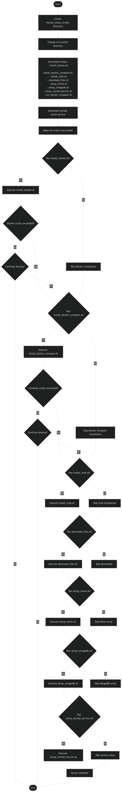

# Marauder Script Documentation

This document provides detailed information about the marauder.sh script and its components.

## Overview

The marauder.sh script is an orchestration tool that automates the setup of a complete Myriad environment. It downloads and executes multiple component scripts in sequence, each handling a specific part of the setup process.

## Component Scripts

### 1. install_docker.sh
- Updates package lists and installs prerequisites
- Adds Docker's official GPG key and repository
- Installs Docker CE
- Adds current user to docker group for non-root access

### 2. install_docker_compose.sh
- Creates Docker CLI plugins directory
- Downloads Docker Compose v2.26.1
- Sets up Docker Compose as a Docker CLI plugin

### 3. install_zrok.sh
- Downloads and extracts zrok v0.4.40
- Prompts for and configures zrok token
- Sets up public shares for ports 8080 and 8081
- Enables headless mode for tunneling

### 4. download_files.sh
- Creates myriad-setup directory structure
- Downloads docker-compose.yml configuration
- Generates random credentials for:
  - MongoDB user and password
  - MinIO root user and password
  - App secret
  - JWT token secrets
- Downloads MongoDB dump files for initial data

### 5. setup_minio.sh
- Reads MinIO credentials from docker-compose.yml
- Starts MinIO container
- Creates access and secret keys
- Updates configuration with new credentials

### 6. setup_mongodb.sh
- Installs MongoDB database tools if needed
- Creates data directory
- Starts MongoDB container
- Restores initial data from dump files
- Configures authentication

### 7. setup_myriad_service.sh
- Configures systemd service for Myriad
- Updates service file with correct user path
- Enables and starts the service
- Sets up zrok URLs for web and API access

## Execution Flow

1. The script creates a working directory: myriad_setup_scripts
2. Downloads all component scripts from the repository
3. Makes scripts executable
4. Runs each script in sequence with confirmation prompts
5. Handles errors with continue/abort options
6. Sets up complete environment ready for use

## Generated Files

The script creates several important files:
- /etc/systemd/system/myriad-social.service
- ~/.docker/cli-plugins/docker-compose
- myriad-setup/docker-compose.yml
- Various configuration and credential files

## Requirements

- Ubuntu 22.04 or compatible Linux system
- Sudo privileges
- Internet connection
- Basic understanding of Docker and services

## Troubleshooting

If any component script fails:
1. Check the error message
2. Choose to continue or abort
3. Review logs in myriad_setup_scripts directory
4. Ensure all prerequisites are met

## Security Notes

- Random credentials are generated for all services
- Credentials are stored in docker-compose.yml
- Service runs under specified user context
- Docker socket is properly secured
